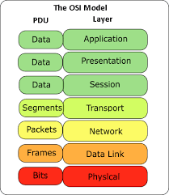
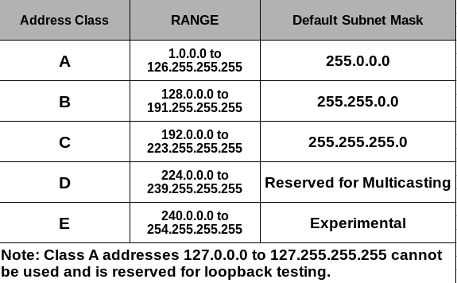

# Net_Practice
## Network?:
A computer network comprises two or more computers that are connected—either by cables (wired) or WiFi (wireless)—with the purpose of transmitting, exchanging, or sharing data and resources. You build a computer network using hardware (e.g., routers, switches, access points, and cables) and software (e.g., operating systems or business applications).
## Network types:
LAN (local area network),MAN (metropolitan area network),WAN (wide area network),WLAN (wireless local area network),
PAN (personal area network),SAN (storage area network).
## Network types:
Network architecture refers to a network’s structural and logical layout. It describes how the network devices are connected and the rules that govern data transfer between them.
## Types of Networking Architecture:

## Network Topology:
    - Physical topology:
        is how they are actually interconnected with wires and cables.

    - Logical topology:
        is how devices appear connected to the user.
## Terms and concepts:
    - Nodes:
        A node is a connection point inside a network that can receive, send, create, or store data.
    - Routers:
        A router is a physical or virtual device that sends information contained in data packets between networks.Routers analyze data within the packets to determine the best way for the information to reach its ultimate destination. Routers forward data packets until they reach their destination node.
    - Switches:
        A switch is a device that connects other devices and manages node-to-node communication within a network, ensuring data packets reach their ultimate destination.
    - Ports:
        A port identifies a specific connection between network devices. Each port is identified by a number. If you think of an IP address as comparable to the address of a hotel, then ports are the suites or room numbers within that hotel.
    - Network cable types:
        The most common network cable types are Ethernet twisted pair, coaxial, and fiber optic. The choice of cable type depends on the size of the network, the arrangement of network elements, and the physical distance between devices.
## The OSI Model:
The Open Systems Interconnection (OSI) model describes seven layers that computer systems use to communicate over a network.

## Network Protocol:
A network protocol is an established set of rules that determine how data is transmitted between different devices in the same network.
## Encapsulation and decapsulation process in osi model:

## Protocol Data Unit (PDU):
A protocol data unit (PDU) is an open-system interconnection (OSI) term used in telecommunications that refers to a group of information added or removed by a layer of the OSI model. Each layer in the model uses the PDU to communicate and exchange information, which can only be read by the peer layer on the receiving device and is then handed over to next upper layer after stripping.

## TCP/IP model and correspondence with osi model:
The TCP/IP model is a concise version of the OSI model. It contains four layers, unlike seven layers in the OSI model. The layers are:

## IPV4:
The IPv4 address is a 32-bit number that uniquely identifies a network interface on a machine. An IPv4 address is typically written in decimal digits, formatted as four 8-bit fields that are separated by periods. Each 8-bit field represents a byte of the IPv4 address. This form of representing the bytes of an IPv4 address is often referred to as the dotted-decimal format.

The bytes of the IPv4 address are further classified into two parts: the network part and the host part. The following figure shows the component parts of a typical IPv4 address, 192.168.1.34

    - IPV4 classes:

    - public and private IPV4:

## Netmasks:
Netmasks (or subnet masks) are a shorthand for referring to ranges of consecutive IP addresses in the Internet Protocol. They used for defining networking rules in routers and firewalls.

## How Do IP Address Blocks Work:
IPv4 addresses like 172.16.254.1 are really just decimal representations of four binary blocks.
Each block is 8 bits, and represents numbers from 0-255. Because the blocks are groups of 8 bits, each block is known as an octet. And since there are four blocks of 8 bits, every IPv4 address is 32 bits.
    

To convert an IP address between its decimal and binary forms, you can use this chart:
    

Now lets say you want to convert the IP address 168.210.225.206. All you need to do is break the address into four blocks (168, 210, 225, and 206), and convert each into binary using the chart above.

Remember that in binary, 1 is the equivalent to "on" and 0 is "off". So to convert the first block, 168, into binary, just start from the beginning of the chart and place a 1 or 0 in that cell until you get a sum of 168.

For example: 128 + 32 + 8 = 168, which in binary is 10101000.

If you do this for the rest of the blocks, you'd get 10101000.11010010.11100001.11001110.
## Subnetting:
Is a way to split up an IP address into smaller networks called subnets.
    

So generally, subnetting does two things: it gives us a way to break up networks into subnets, and allows devices to determine whether another device/IP address is on the same local network or not.
## Subnet Masks:
Subnet masks function as a sort of filter for an IP address. With a subnet mask, devices can look at an IP address, and figure out which parts are the network bits and which are the host bits.
## CIDR Notation:
CIDR stands for Classless Inter-Domain Routing, and is used in IPv4, and more recently, IPv6 routing.
    

